<p align="center">
  
</p>

<p align="center">
  <strong>Learn · Build · Grow</strong><br />
  A premium AI engineering learning and career platform for developers.
</p>

<p align="center">
  <a href="https://github.com/LahariReddy5152/NexusAI-project-commit"></a>
  <a href="https://github.com/LahariReddy5152/NexusAI-project-commit"></a>
  <a href="https://github.com/LahariReddy5152/NexusAI-project-commit/blob/main/LICENSE"></a>
</p>

---

## Overview

**NexusAI** is a full-stack AI engineer learning platform that combines structured curricula, hands-on projects, interview preparation, career tooling, and an integrated Virtual Recruiter — with a premium **light mode** glass UI (optional dark mode) and optional Electron desktop delivery.

Whether you are breaking into AI engineering or leveling up for your next role, NexusAI provides a single workspace to study, build portfolio projects, practice interviews, analyze resumes, and get AI-powered mentorship.

---

## Features

### Learning
- Multi-track curricula: Python, SQL, Java, Spring Boot, AI fundamentals, prompt engineering, RAG, LangChain, OpenAI APIs
- Interactive lesson workspace with code examples and progression tracking
- Breadcrumb navigation and per-technology depth modules

### Projects
- Real-world project blueprints with step-by-step builders
- GitHub integration: connect accounts, sync repos, track commits
- Progress persistence across sessions

### Interview Prep
- Mock, technical, system design, and AI-track interview modes
- Timed workspace with side-by-side question and answer panels
- Speech evaluation and voice-aware mock sessions

### Career
- Resume analyzer and job-tailoring engine
- Career roadmap builder with skill milestones
- Job readiness scoring and achievement tracking

### Virtual Recruiter
- Context-aware AI mentor across dashboard, coding lab, and interview modes
- Mode-specific knowledge bases (coding assistant, interview coach, career advisor)
- Chat history synced to backend

### Platform
- JWT authentication with signup, login, remember me, and password reset
- SQLite persistence with user profiles, progress, dashboard stats, projects, interview scores, and settings
- Native desktop notifications via Electron
- Responsive glassmorphism UI with light default theme and static dashboard background
- Official NexusAI logo system (SVG source + generated ICO/PNG/ICNS in `build/`)

---

## Architecture

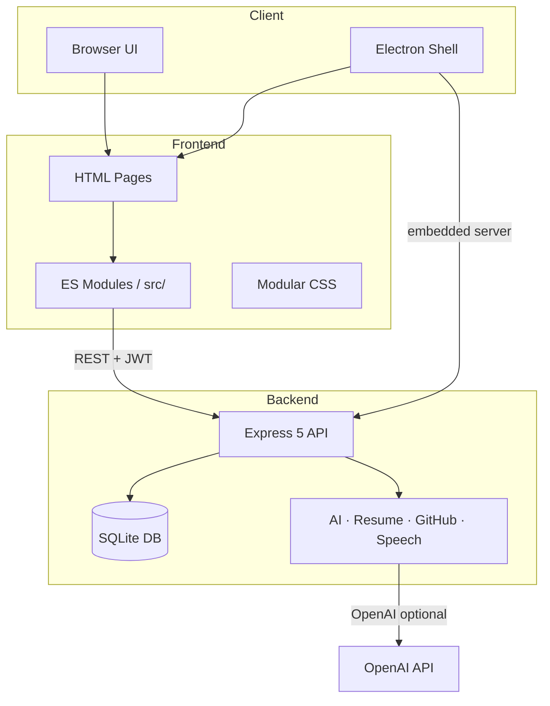

| Layer | Technology | Responsibility |
|-------|------------|----------------|
| **Presentation** | HTML, CSS, vanilla JS | Dashboard, learn portal, interview workspace |
| **Desktop** | Electron 35 | Embedded server, native window, IPC bridge |
| **API** | Express 5, JWT, bcrypt | Auth, progress, AI, resume, GitHub, speech |
| **Data** | Node SQLite (`node:sqlite`) | Users, tokens, progress, notifications |
| **Docs** | OpenAPI 3 + Swagger UI | Interactive API reference at `/api/docs` |

---

## Demo

| | |
|---|---|
| **Web app** | `npm install && npm start` → http://localhost:5000 |
| **Desktop (dev)** | `npm run electron` |
| **Windows installer** | [Download v1.0.0](https://github.com/LahariReddy5152/NexusAI-project-commit/releases/tag/v1.0.0) (after release publish) |
| **API docs** | http://localhost:5000/api/docs |
| **Portfolio copy** | [docs/PORTFOLIO.md](docs/PORTFOLIO.md) |

---

## Screenshots

| Login | Dashboard | Learn |
|:-----:|:---------:|:-----:|
| 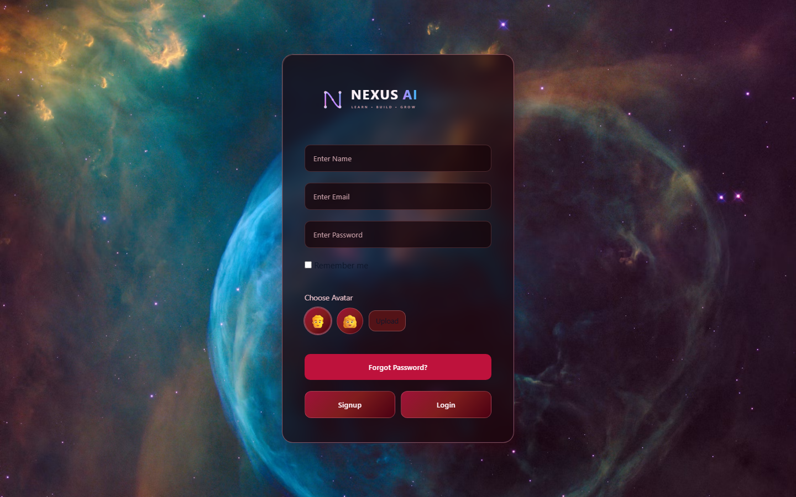 | 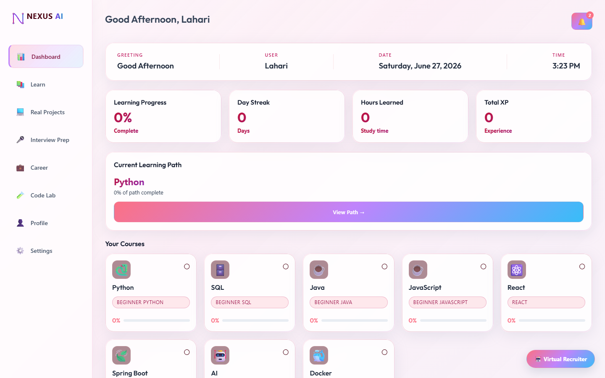 | 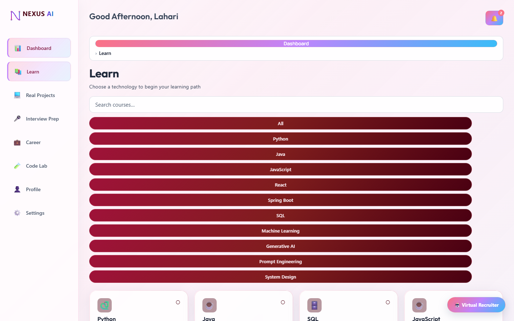 |

| Projects | Interview Prep | Career |
|:--------:|:--------------:|:------:|
| 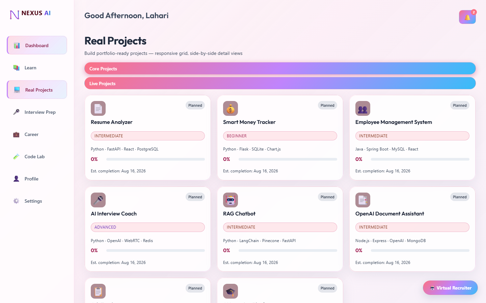 | 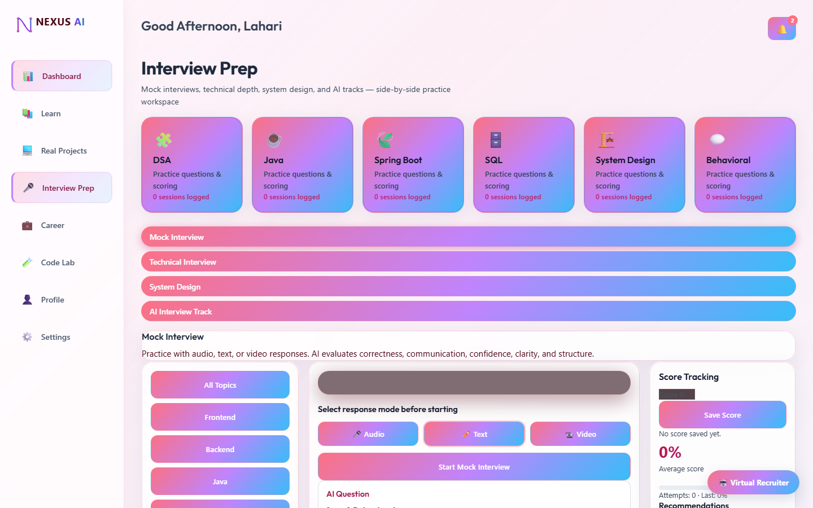 | 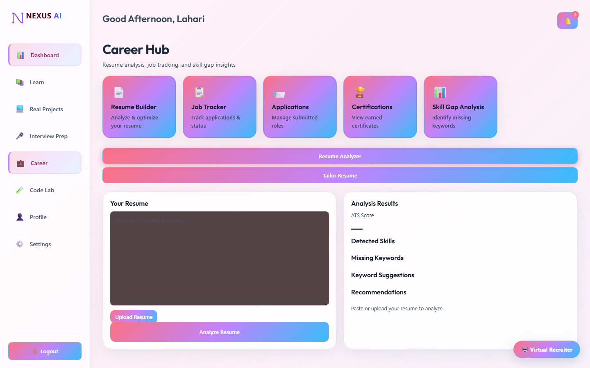 |

| Virtual Recruiter | Desktop Installer |
|:-----------------:|:-----------------:|
| 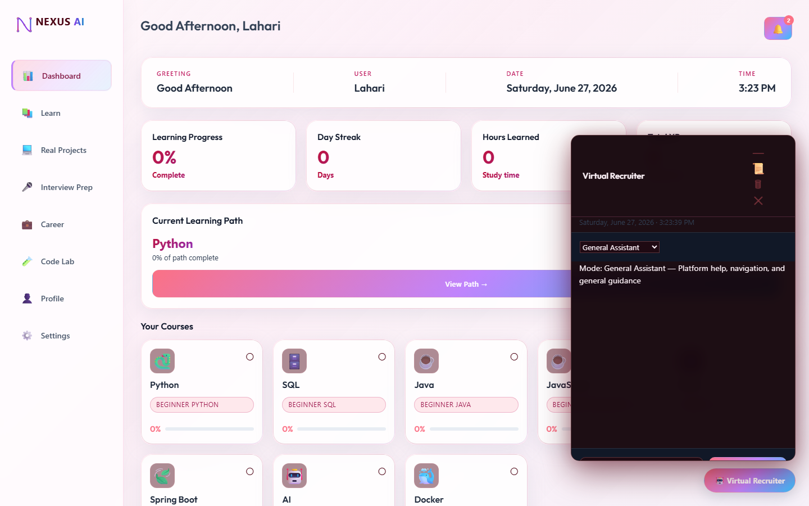 | 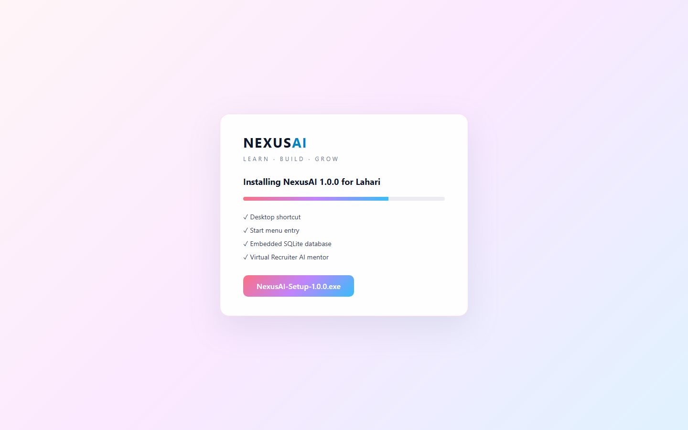 |

| Profile | Code Lab | Python Workspace |
|:-------:|:--------:|:----------------:|
| 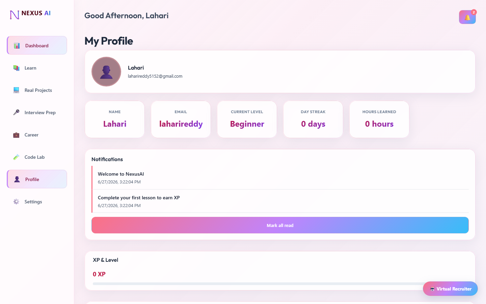 | 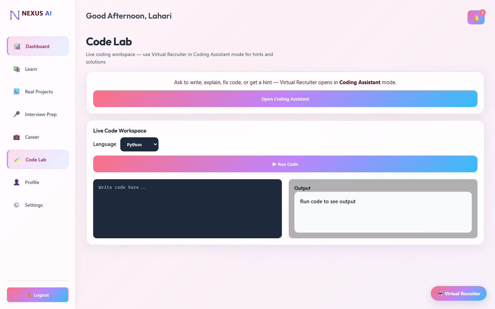 | 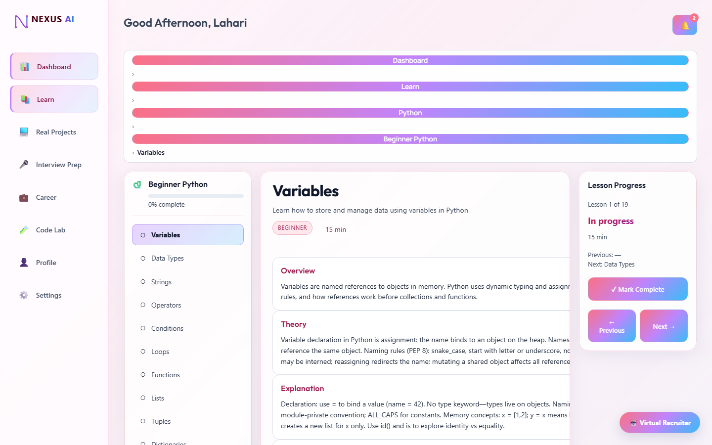 |

_All screenshots show the default **light mode** UI with demo user **Lahari** (`laharireddy5152@gmail.com`)._

---

## Installation

### Prerequisites

- **Node.js** 20+ (22 recommended for SQLite support)
- **npm** 10+
- **Windows 10/11** (for desktop installer builds)

### Quick start (web)

```bash
git clone https://github.com/LahariReddy5152/NexusAI-project-commit.git
cd NexusAI-project-commit
npm install
npm start
```

Open **http://localhost:5000** in your browser.

### Environment variables

| Variable | Description | Default |
|----------|-------------|---------|
| `PORT` | HTTP server port | `5000` |
| `OPENAI_API_KEY` | Live OpenAI responses (optional) | Rule-based fallback |
| `NEXUSAI_DATA_DIR` | SQLite data directory | `./data` (web) or `%APPDATA%/nexusai` (desktop) |
| `JWT_SECRET` | Token signing secret | Dev fallback string (set in production) |

Create a `.env` file in the project root (not committed):

```env
OPENAI_API_KEY=sk-your-key-here
JWT_SECRET=your-production-secret
```

---

## Desktop application

NexusAI ships as a production Windows desktop app via Electron.

### Development mode

```bash
npm run electron
```

Launches the Electron window with an embedded Express server on a dynamic local port.

### Build installers

```bash
# NSIS installer + portable executable
npm run build:win

# Unpacked portable folder only
npm run build:dir
```

### Production artifacts

| Artifact | Path |
|----------|------|
| **Setup installer** | `dist/NexusAI-Setup-1.0.0.exe` |
| **Portable app** | `dist/NexusAI-Portable-1.0.0.exe` |
| **Unpacked executable** | `dist/win-unpacked/NexusAI.exe` |

The installer provides:
- Desktop shortcut
- Start menu entry
- Uninstall support via Windows Settings
- Per-user installation with custom install location
- Application icon from `build/icon.ico`

### Desktop data locations

| Item | Windows path |
|------|----------------|
| **App data** | `%APPDATA%\nexusai` |
| **Database** | `%APPDATA%\nexusai\nexusai.db` |

---

## Technologies used

| Category | Stack |
|----------|-------|
| **Frontend** | HTML5, CSS3 (modular), vanilla JavaScript (ES modules) |
| **3D / visuals** | Three.js (login), static dashboard background, glassmorphism, light/dark themes |
| **Backend** | Node.js, Express 5, `node:sqlite` |
| **Auth** | JWT, bcryptjs |
| **AI** | OpenAI API (optional) with rule-based fallback |
| **Desktop** | Electron 35, electron-builder, NSIS |
| **API docs** | OpenAPI 3, Swagger UI |
| **Testing** | Playwright verification scripts |
| **Assets** | SVG logo system, `@resvg/resvg-js`, png-to-ico |

---

## Folder structure

```
NexusAI-project-commit/
├── assets/
│   ├── images/              # Backgrounds and marketing art
│   └── logo/                # Official logo SVGs (+ run npm run generate:logo for PNG/ICO)
├── build/                   # Electron icons (icon.ico, icon.png, icon.icns)
├── dist/                    # Production installers (generated)
├── electron/
│   ├── main.js              # Desktop entry, embedded server, window
│   └── preload.js           # nexusDesktop IPC bridge
├── server/
│   ├── app.js               # Express application factory
│   ├── db.js                # SQLite schema and queries
│   ├── routes/api.js        # REST API routes
│   ├── services/            # AI, resume, GitHub, speech services
│   ├── openapi.yaml         # OpenAPI specification
│   └── start.js             # Server bootstrap
├── src/
│   ├── authentication/      # Auth UI and JWT guard
│   ├── background/          # Galaxy / login backgrounds
│   ├── career/              # Roadmap and career panels
│   ├── coding-lab/          # Code lab workspace
│   ├── dashboard/           # Dashboard modules
│   ├── interview/           # Interview prep tracks
│   ├── learn/               # Learning portal and curricula
│   ├── notifications/       # Notification center
│   ├── profile/             # Profile and achievements
│   ├── projects/            # Project builder and GitHub
│   ├── shared/              # API client, styles, helpers
│   └── virtual-recruiter/   # VR chat, modes, knowledge
├── scripts/                 # Verification and asset generation
├── index.html               # Login page
├── dashboard.html           # Main application shell
├── server.js                # Web server entry point
├── style.css                # CSS entry (imports modular parts)
└── package.json
```

---

## Development setup

```bash
# Install dependencies
npm install

# Start web server (port 5000)
npm start

# Start Electron desktop app
npm run electron

# Regenerate logo PNG / ICO / ICNS assets
npm run generate:logo

# Run phase verification scripts
node scripts/verify-phase6.mjs   # Backend integrations
node scripts/verify-phase7.mjs   # Electron desktop
node scripts/verify-phase8.mjs   # Production Windows release
node scripts/verify-phase10.mjs  # End-to-end validation
```

### API documentation

With the server running, open:

- **Swagger UI:** http://localhost:5000/api/docs
- **OpenAPI spec:** http://localhost:5000/api/openapi.yaml

### Key API endpoints

| Method | Endpoint | Description |
|--------|----------|-------------|
| `POST` | `/api/auth/signup` | Register a new user |
| `POST` | `/api/auth/login` | Login and receive JWT |
| `POST` | `/api/auth/forgot-password` | Request password reset |
| `GET` | `/api/auth/me` | Current user profile |
| `POST` | `/api/ai/chat` | Virtual Recruiter / AI chat |
| `POST` | `/api/resume/analyze` | ATS resume scoring |
| `POST` | `/api/resume/tailor` | Job-specific resume tailoring |
| `POST` | `/api/github/connect` | Link GitHub username |
| `POST` | `/api/speech/evaluate` | Interview speech analysis |
| `GET` | `/api/dashboard/stats` | Dashboard statistics (XP, streak, hours, progress) |
| `GET` | `/api/progress/courses` | Learning progress |
| `GET` | `/api/progress/projects` | Project progress |
| `GET` | `/api/notifications` | User notifications |

All protected routes require `Authorization: Bearer <token>`.

---

## Future roadmap

- [ ] macOS and Linux desktop builds (`.dmg`, AppImage)
- [ ] Code signing for Windows and macOS distributions
- [ ] Cloud deployment (Docker, CI/CD, hosted API)
- [ ] Live OpenAI streaming responses in Virtual Recruiter
- [ ] Video lesson integration and certificate generation
- [ ] Team / classroom admin mode
- [ ] Mobile-responsive PWA with offline lesson cache
- [ ] Expanded analytics dashboard for learning insights
- [ ] Plugin system for third-party curricula

---

## License

This project is licensed under the **ISC License**.

Copyright © 2026 [Lahari Reddy](https://github.com/LahariReddy5152)

---

## Author

**Lahari Reddy** — [GitHub](https://github.com/LahariReddy5152) · [NexusAI Repository](https://github.com/LahariReddy5152/NexusAI-project-commit)

<p align="center">
  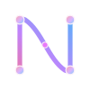
</p>
